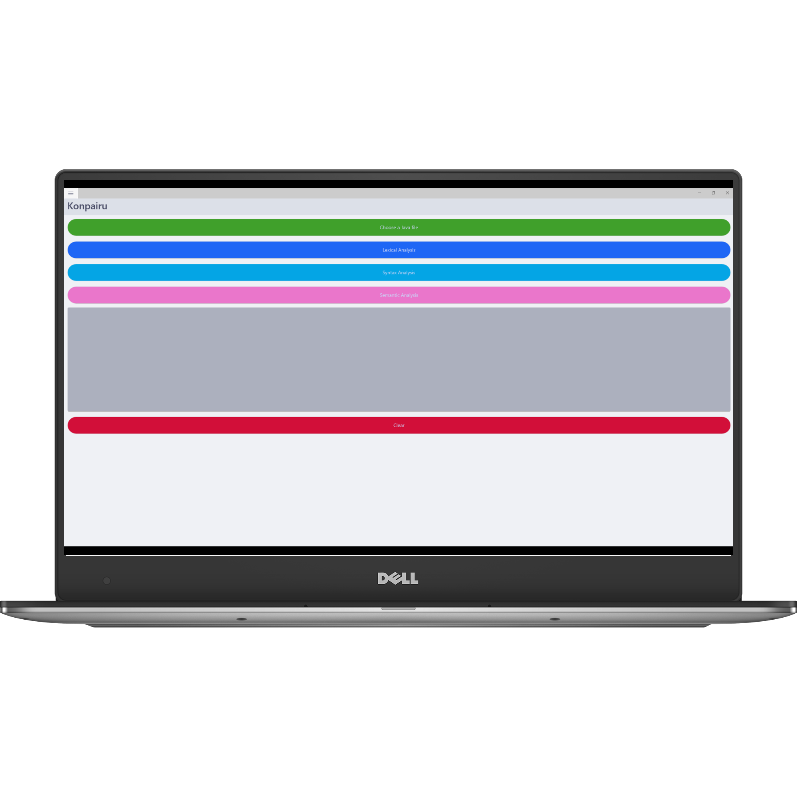
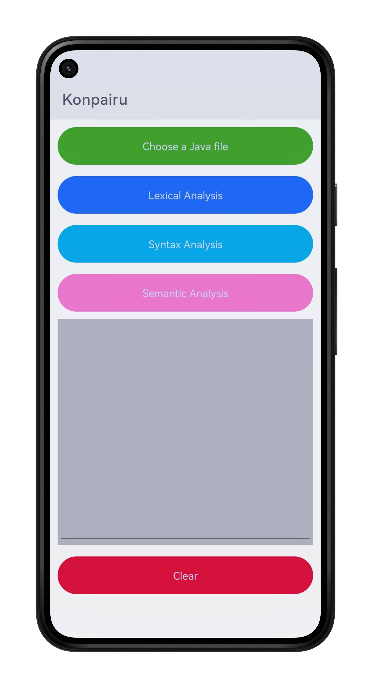
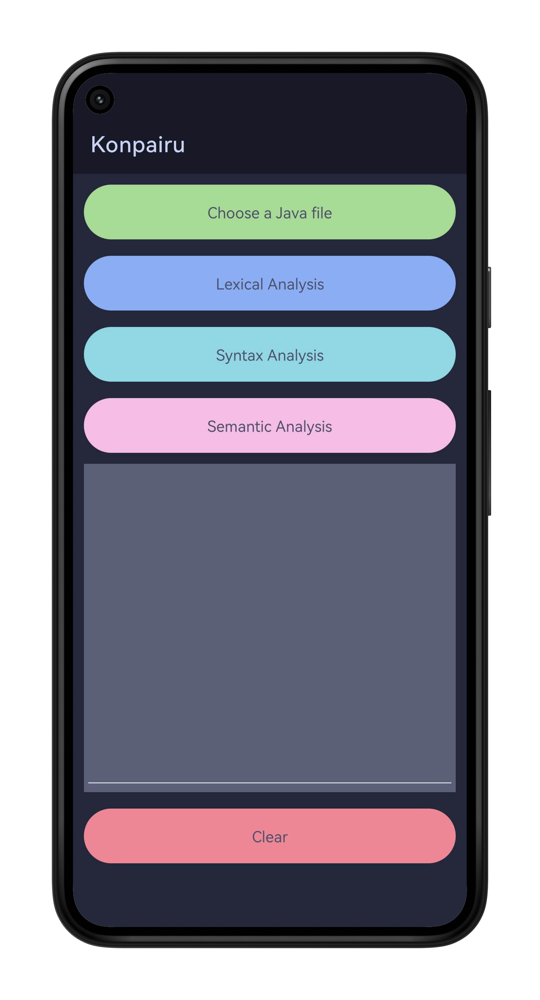
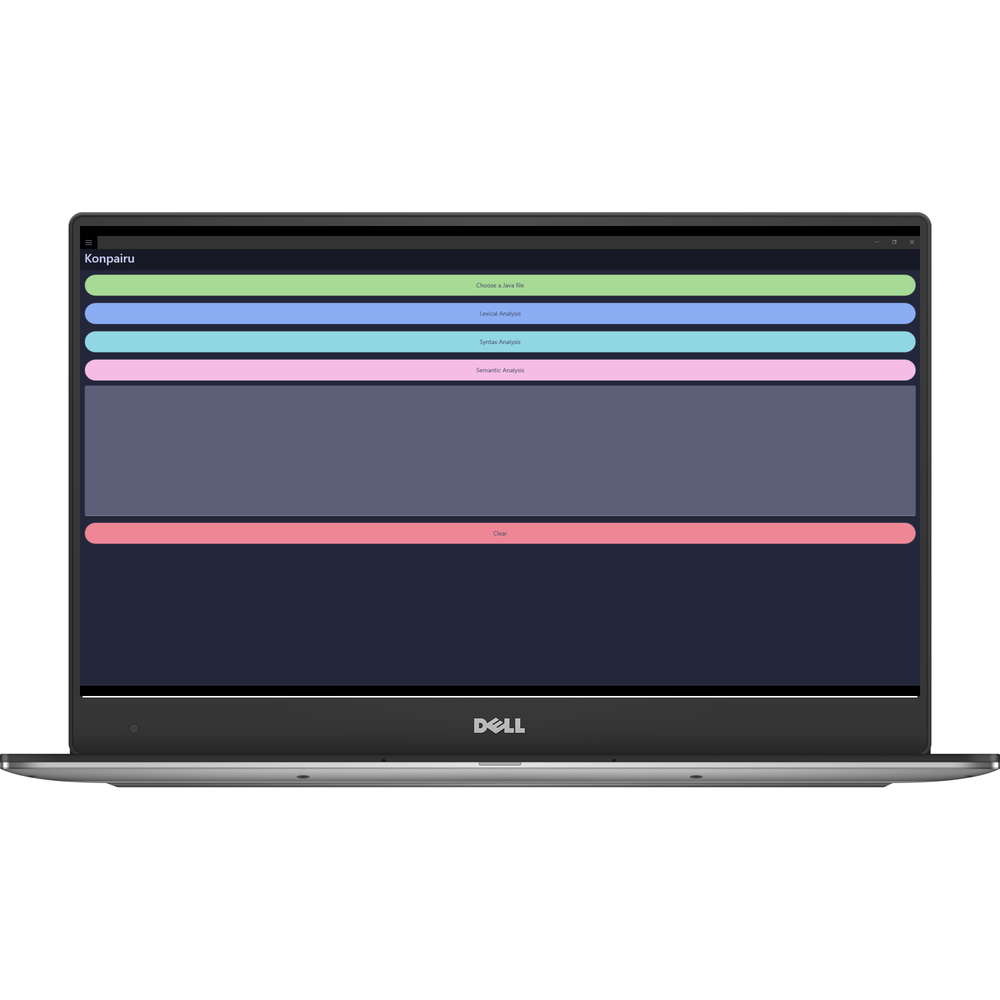

<h1 align="center">Konpairu</h1>
<p align="center">
  <a href="https://github.com/davidkingroderos/konpairu/graphs/contributors">
    
  </a>
  <a href="https://github.com/davidkingroderos/konpairu/stargazers">
    
  </a>
  <a href="https://github.com/davidkingroderos/konpairu/forks">
    
  </a>
  <a href="https://github.com/davidkingroderos/konpairu/blob/main/LICENSE">
    
  </a>
</p>

Konpairu is a graphical user interface (GUI) application created using .NET MAUI (Multi-platform App UI). This application incorporates lexical, syntactical, and semantic analysis features.

## Screenshots
<p align="center">
  
  
</p>
<p align="center">
   
  
</p>

## Features

**Lexical Analyzer:**
The application includes a lexical analyzer responsible for tokenizing input source code or text, breaking it down into tokens for further analysis.

**Syntactical Analyzer:**
The syntactical analyzer parses the structure of the source code to ensure it conforms to the grammar rules of a specific programming language or syntax.

**Semantic Analyzer:**
This module performs deeper analysis, checking the meaning and context of the code, aiming to identify errors that might not be caught by the syntactical analysis alone.

## Installing

1. Clone this repository to your local machine using Git or download the zip file.

```bash
  git clone https://github.com/davidkingroderos/konpairu.git
```

3. Open the project in Visual Studio.

4. Build the project to resolve dependencies.

5. Run the application using the .NET MAUI and deploy it to your preferred device.

## Contributing

Contributions are welcome! If you'd like to improve Konpairu or add features, feel free to fork the repository and submit a pull request.

## License

This project is licensed under the [MIT License](https://github.com/davidkingroderos/konpairu/blob/main/LICENSE).
